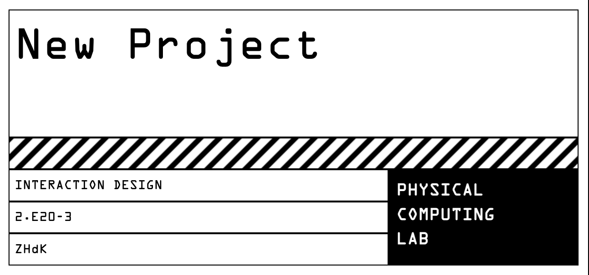

A label generator for the Physical Computing lab at ZHdK

Currently configured for 62mm*100mm and 29mm*62mm labels for Brother QL series printers 



## Installation

Clone this repo and npm install.

```bash
npm i
```

## Usage

### Development server

```bash
npm start
```

You can view the development server at `localhost:8080`.

### Production build

```bash
npm run build
```
